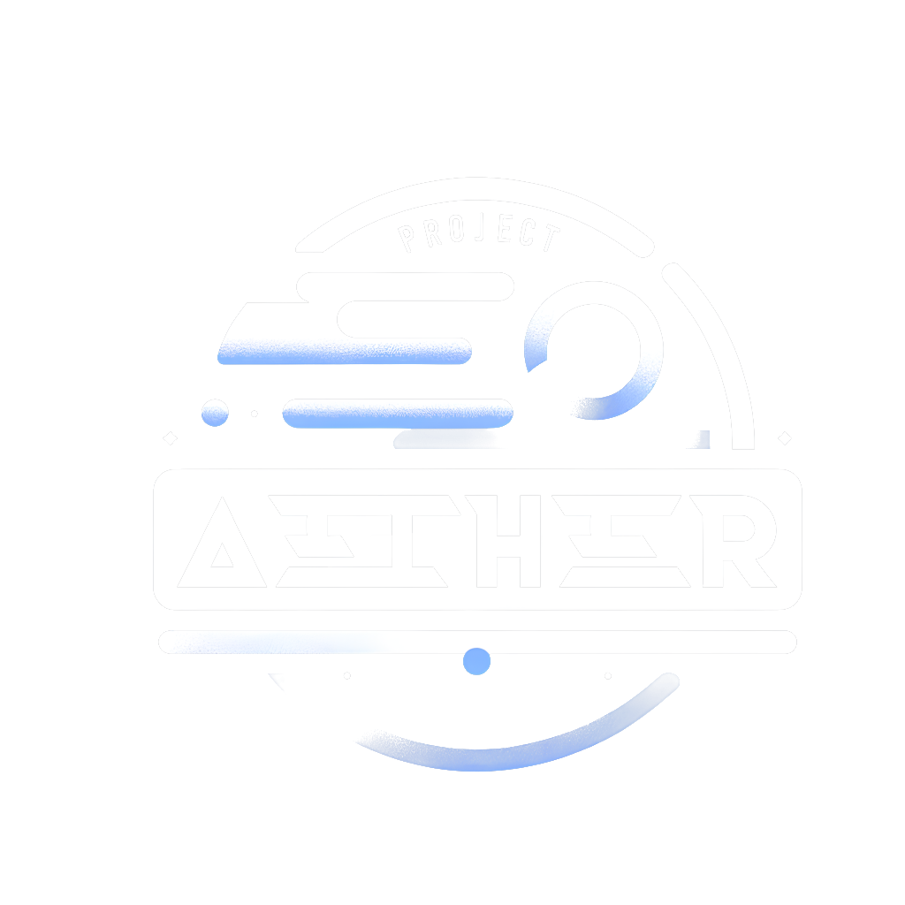

<h1 align="center">A performant, cross-platform game engine

## What is Aether?

Aether is a game engine written in [Zig](https://ziglang.org/)

It is platform agnostic; there should be no difference running between Windows, Linux, and consoles like the PSP or the 3DS.

All user code is provided as hooks into the engine. The user simply writes the code that will be executed by the engine by extension, and the engine will handle the rest.

This leads to the guarantees of platform independence, performance, and ease of use by allowing the user to focus on the game logic rather than the underlying platform details, and allowing the engine to handle the complexities of the platform behind the scenes.
