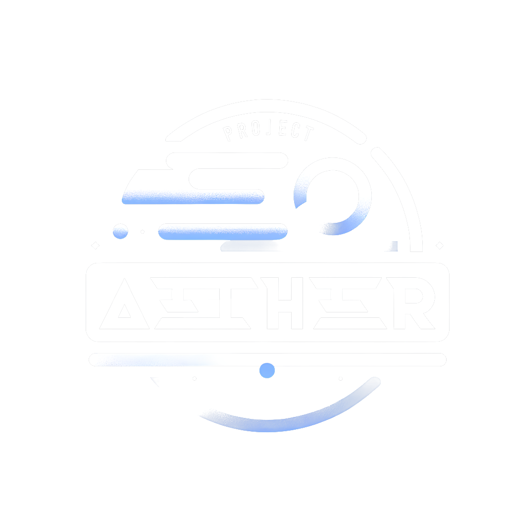

<div align="center"></div>
<h2 align="center">A performant, cross-platform game engine</h2>

## What is Aether?

Aether is a game engine written in [Zig](https://ziglang.org/). It is platform-agnostic — there should be no difference running between Windows, Linux, macOS, and consoles like the PSP or the 3DS.

User code is structured as hooks into the engine via a `State` interface. You implement the game logic; the engine handles the platform details.

## Features

- **Cross-platform**: Windows, Linux, macOS (PSP/3DS planned)
- **Multiple graphics backends**: OpenGL 4.5, Vulkan — selected at compile time, overridable with `-Dgfx=opengl`
- **Fixed-step game loop**: 144 Hz updates, 20 Hz ticks, uncapped rendering
- **Action-based input system**: keyboard, mouse, and gamepad with callback bindings
- **Generic mesh & pipeline API**: define vertex layouts from structs using comptime reflection
- **Budgeted memory pools**: render, audio, game, user, and scratch — no hidden heap allocations

## Requirements

- Zig **0.16.0-dev** or later (see `build.zig.zon` for exact minimum)
- GLFW 3 (system library)
- Vulkan SDK (for `glslc` shader compiler and Vulkan headers)

## Getting Started

Add Aether as a dependency in your `build.zig.zon`, then set up your `build.zig`:

```zig
const aether = @import("aether");

pub fn build(b: *std.Build) void {
    const target = b.standardTargetOptions(.{});
    const optimize = b.standardOptimizeOption(.{});

    const exe = aether.addGame(b, .{
        .name = "my_game",
        .root_source_file = b.path("src/main.zig"),
        .target = target,
        .optimize = optimize,
    });

    aether.addShader(b, exe, config, "basic", .{
        .glsl_vert = b.path("shaders/basic.vert"),
        .glsl_frag = b.path("shaders/basic.frag"),
        .vulkan_vert = b.path("shaders/basic_vk.vert"),
        .vulkan_frag = b.path("shaders/basic_vk.frag"),
    });

    b.installArtifact(exe);
}
```

Then write your game code:

```zig
const std = @import("std");
const ae = @import("aether");

const MyState = struct {
    fn init(ctx: *anyopaque) anyerror!void { _ = ctx; }
    fn deinit(ctx: *anyopaque) void { _ = ctx; }
    fn tick(ctx: *anyopaque) anyerror!void { _ = ctx; }
    fn update(ctx: *anyopaque, dt: f32) anyerror!void { _ = ctx; _ = dt; }
    fn draw(ctx: *anyopaque, dt: f32) anyerror!void { _ = ctx; _ = dt; }

    pub fn state(self: *MyState) ae.Core.State {
        return .{ .ptr = self, .tab = &.{
            .init = init, .deinit = deinit,
            .tick = tick, .update = update, .draw = draw,
        }};
    }
};

pub fn main(init: std.process.Init) !void {
    const memory = try init.arena.allocator().alloc(u8, 32 * 1024 * 1024);
    const config = ae.Util.MemoryConfig{
        .render = 8 * 1024 * 1024,
        .audio = 2 * 1024 * 1024,
        .game = 2 * 1024 * 1024,
        .user = 16 * 1024 * 1024,
        .scratch = 4 * 1024 * 1024,
    };
    var my_state: MyState = undefined;
    try ae.App.init(init.io, memory, config, 1280, 720, "My Game", false, true, &my_state.state());
    defer ae.App.deinit();
    try ae.App.main_loop();
}
```

Platform and graphics backend are available as comptime constants for per-platform configuration:

```zig
const memory_config: ae.Util.MemoryConfig = switch (ae.platform) {
    .psp => .{ .render = 512 * 1024, .audio = 256 * 1024, ... },
    else => .{ .render = 8 * 1024 * 1024, .audio = 2 * 1024 * 1024, ... },
};
```

## Building

```sh
# Build and run
zig build run

# Run tests
zig build test

# Override graphics backend
zig build run -Dgfx=opengl
```

## Input System

Actions are registered by name and bound to one or more input sources:

```zig
try ae.Core.input.register_action("jump", .button);
try ae.Core.input.bind_action("jump", .{ .source = .{ .key = .Space } });
try ae.Core.input.add_button_callback("jump", ctx, on_jump);
```

Supported sources: keyboard keys, mouse buttons, mouse scroll, mouse relative movement, and gamepad buttons/axes.

## Rendering

Define a vertex type, create a pipeline, and draw meshes:

```zig
const Vertex = struct {
    pos: [3]f32,
    color: [4]u8,

    pub const Attributes = Rendering.Pipeline.attributes_from_struct(@This(), &.{
        .{ .field = "pos", .location = 0 },
        .{ .field = "color", .location = 1 },
    });
    pub const Layout = Rendering.Pipeline.layout_from_struct(@This(), &Attributes);
};

const MyMesh = Rendering.Mesh(Vertex);
```

Shaders are registered via `addShader` in your `build.zig` and embedded at compile time. The build system handles GLSL vs SPIR-V compilation automatically based on the target backend.

## License

See [LICENSE](LICENSE).
